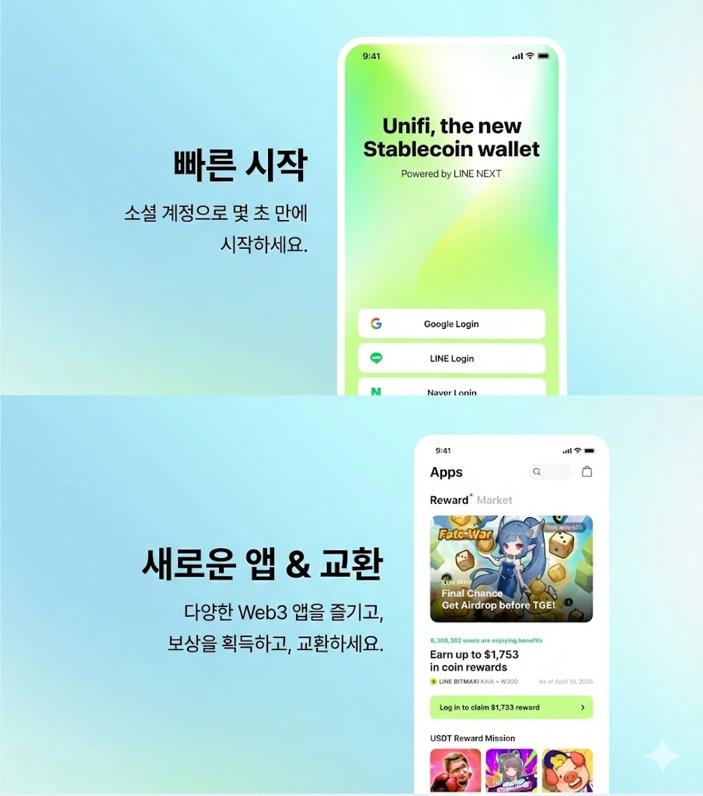

---
metaLinks:
  alternates:
    - https://app.gitbook.com/s/juuhQ1BuKwYKE7NR6geM/unifi-and-unifi-apps
---

# Unifi & Unifi Apps

## 소개

Unifi는 별도의 앱 설치 없이 LINE 메신저와 웹 환경에서 네이티브로 실행되는 Kaia 블록체인 기반의 스테이블코인 중심 Web3 월렛이자 플랫폼입니다. 사용자는 이를 통해 다양한 앱 서비스, 결제, 이자 수익 및 송금 기능을 이용할 수 있으며, 개발자는 Unifi Apps SDK를 통해 자신의 Web3 서비스를 손쉽게 통합하고 온보딩할 수 있습니다.

Unifi Apps 내에서 사용자는 다음 작업을 간편하게 수행할 수 있습니다:

* 다양한 Web3 애플리케이션 탐색 및 접속
* 앱 활동 참여를 통한 리워드 획득
* Kaia 기반 토큰 및 기타 디지털 자산 거래
* Unifi Wallet을 통한 끊김 없는(Seamless) Web3 경험

## Unifi Apps에 참여하세요!

프로젝트 팀은 [웹사이트](https://developers.dappportal.io/)를 통해 간단한 신청서를 제출함으로써 Unifi Apps에 참여할 수 있습니다. 온보딩된 파트너는 LINE NEXT와 Kaia Foundation의 지원을 바탕으로 포괄적인 마케팅 및 기술 지원을 받게 됩니다.

Unifi Apps는 스테이블코인 기반 리워드 프로그램을 통해 프로젝트가 사용자를 확보하도록 돕는 것은 물론, LINE 생태계로의 진입 과정을 간소화하도록 설계되었습니다. 개발자는 Unifi Apps의 강력하고 즉시 사용 가능한 기능들을 활용하여 Web3 서비스를 쉽게 통합하고, 결제 기능을 활성화하며, 성장에 초점을 맞춘 마케팅 캠페인을 실행할 수 있습니다.

## Unifi Apps의 주요 기능 및 이점

<figure><figcaption></figcaption></figure>

Unifi Apps SDK는 Mini App 개발자가 자신의 서비스에 Web3 기능을 더 쉽고 간편하게 통합할 수 있도록 지원합니다. (주요 환경: LINE, Web)

### 매끄러운 LINE 통합 (Seamless LINE Integration)

* 간편한 온보딩 (Frictionless onboarding): 사용자는 별도의 회원가입 절차 없이 LINE 계정으로 즉시 로그인할 수 있습니다.
* 내장된 소셜 파급력 (Built-in social reach): 메시지 공유, LINE Login, LIFF, LINE Mini App 통합 등 LINE 고유의 기능을 활용하여 신규 사용자를 확보하고 유지율(Retention)을 높일 수 있습니다.

### LINE 네이티브 월렛 및 결제 시스템

* Unifi Wallet: 사용자는 LINE 또는 기타 소셜 로그인을 통해 지갑을 생성할 수 있어, Web2 사용자의 진입 장벽을 획기적으로 낮춥니다.
* 외부 지갑 지원: Kaia Wallet, OKX, Bitget Wallet 등 대중적인 Web3 지갑 연결을 지원합니다.
* 다양한 결제 옵션: 유연한 결제 방식을 통해 게임 아이템, NFT, 디지털 상품을 제공할 수 있습니다.
  * KAIA 및 USDT를 활용한 암호화폐 결제
  * LINE 인앱 결제(IAP) 및 Stripe를 통한 법정화폐(Fiat) 결제
  * _※ 특정 결제 수단의 지원 여부는 앱 버전에 따라 달라질 수 있습니다._

### 마켓플레이스(Marketplace) 및 거래 기능

* NFT 마켓플레이스(Marketplace) 통합: Unifi Apps 내에서 직접 NFT 컬렉션을 런칭하고 판매할 수 있습니다.
* 토큰 스왑 및 온/오프램프 지원: 토큰을 KAIA 또는 USDT로 매끄럽게 스왑(Swap)할 수 있으며, 파트너 거래소를 통해 자산을 온램프(On-ramp) 할 수 있습니다.
