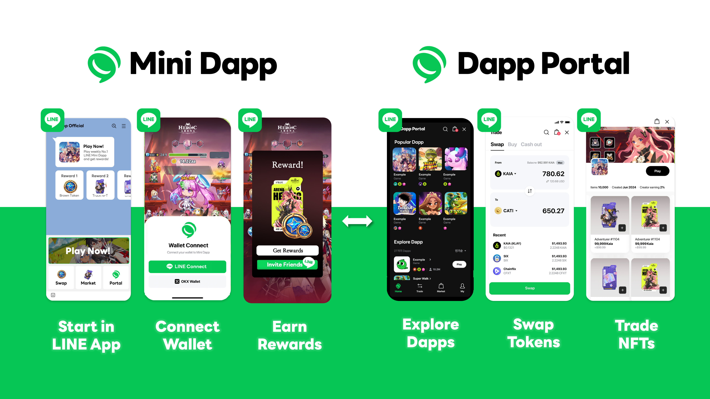

---
metaLinks:
  alternates:
    - https://app.gitbook.com/s/juuhQ1BuKwYKE7NR6geM/
---

# LINE's Mini Dapp & Dapp Portal

## Introduction

Mini Dapps powered by Kaia Blockchain are lightweight Web3 applications that run inside LINE Messenger with Mini Dapp SDK, without requiring any separate app installation. \
Mini Dapps span across categories such as Games, DeFi, AI, and more, all accessible through the Dapp Portal.\
Within the Dapp Portal, users can easily:

* Discover and access a variety of Mini Dapps
* Receive rewards for playing Mini Dapp
* SWAP tokens of Mini Dapp and Trade NFTs
* Experience seamless Web3 interaction with Mini Dapp Wallet

## Kaia Wave Program

Kaia Wave is an onboarding and support program jointly operated by Kaia Foundation and LINE NEXT to help builders successfully launch their Mini Dapps within the LINE ecosystem.

[Apply for the Mini Dapp SDK](https://wave.kaia.io/)

Benefits for Kaia Wave Participants:

* Technical support for the Mini Dapp SDK
* Potential investment opportunities
* Marketing and promotional assistance

## Key Features and Benefits of the Mini Dapp

<figure><figcaption></figcaption></figure>

The Mini Dapp SDK enables developers to easily onboard Web3 services into the LINE ecosystem, integrate payment systems, and run marketing campaigns.\
It comes with a set of powerful features designed to accelerate service growth :

### Seamless LINE Integration

* Frictionless onboarding : Users can log in instantly using their LINE accounts—no additional sign-up required.
* Leverage LINE's social features : Utilize built-in features like message sharing, LIFF integration to boost user acquisition and retention.

### Integrated Wallet & Payment System

* Mini Dapp Wallet: Easily create a wallet via LINE or other social logins, lowering the entry barrier for Web2 users.
* External Wallet Support: Seamlessly connect popular Web3 wallets like Kaia, OKX, and Bitget.
* Multiple Payment Options : Sell in-game items, NFTs, and more with flexible payment options.
  * Crypto payments using KAIA
  * Fiat payments via Stripe

### Promotion & Marketing Support

* TGE (Token Generation Event) Support :\
  Launch your token with full promotional support through Dapp Portal, including exposure, campaign banners, and user engagement tools.
* Reach LINE users directly :\
  The Dapp Portal is connected to your LINE Official Account (OA), enabling visibility to millions of LINE users.
* Campaigns & Events :\
  Run reward campaigns, banners, and event pages to drive user acquisition and engagement.
* LINE Messaging Integration :\
  Send push notifications, event alerts, and re-engagement messages via LINE OA messaging.

### Marketplace & Trading Features

* NFT Marketplace Integration :\
  Launch and sell your own NFT collections directly within your Mini Dapp.
* Token Swap & On-ramp Support :\
  Users can swap other tokens to KAIA or USDT, or directly purchase them using a credit card—no external services required.
