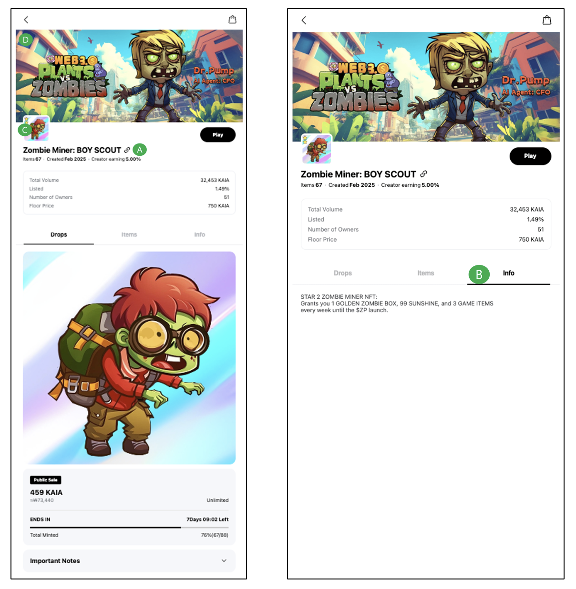

---
metaLinks:
  alternates:
    - >-
      https://app.gitbook.com/s/juuhQ1BuKwYKE7NR6geM/dapp-portal/collection-and-drops/collection-information
---

# Collection Information

## Collection Name

* Displayed in A of the Screen Sample
* English Only

### Token Symbol

* Symbol of Collection
* eg) Collection: Bellygom World Official / Symbol: BELLYGOM

### Collection Description

* Displayed in B of the Screen Sample
* The multilingual language support is: EN (English), JA (Japanese), TH (Thai), TW (Traditional Chinese). All the lanuages must be filled.

## Create Earning

* Create Earning: Fee information received by the Creator in C2C transactions
* Wallet Address | %(Fee)
  * Create Earning fee can be set between 1% and 10%

## Drops Earning&#x20;

* Drops Earning: Fee information received by the Mini Dapp in B2C sales
* If it is the same as the Wallet Address entered for Create Earning, you may leave it blank
* Wallet Address

### Collection Main Image

* Displayed in C of the Screen Sample
* Please select and upload the main image from the Origin contents (NFT images).
* Image Size: 408x408

### **Collection Background Image**

* Displayed in D of the Screen Sample
* Image Size: 1125x459

<figure><figcaption></figcaption></figure>
