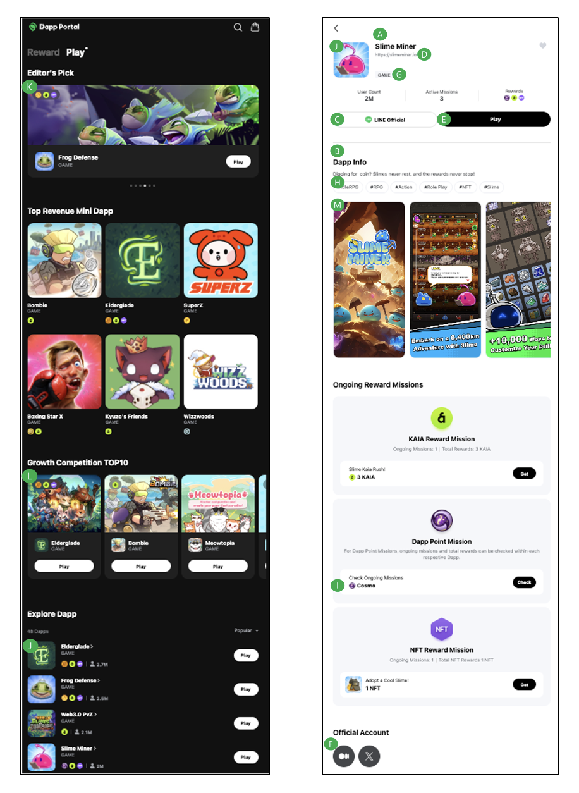

# Mini Dapp Information

#### Mini Dapp Name

* Displayed in A of the Screen Sample
* English Only

#### Mini Dapp Desciption

* Displayed in B of the Screen Sample
* The multilingual language support is: EN (English), JA (Japanese), TH (Thai), TW (Traditional Chinese).
  * All languages are mandatory

#### LINE OA URL

* Displayed in C of the Screen Sample
* How to check the LINE OA [URL](https://manager.line.biz/)
  * Go to LINE Business Mannager > Select Accounts > Navigate to Gain friends > choose "Add friends"

#### Mini Dapp Ofiicial Site

* Displayed in D of the Screen Sample

#### Mini Dapp Play URL

* Displayed in E of the Screen Sample
* Write URLs for two versions: LIFF and External Web

#### SNS URL

* Displayed in F of the Screen Sample
* Select the Ofiicial account platform supported by the Dapp Portal
* Offical account platform: Medium, X (Twitter), Discord

#### Category

* Displayed in G of the Screen Sample
* Category list: Social, Game, Contents, Etc
* Please select one from the provided category list and complete the details.

#### Genere Tag

* Displayed in H of the Screen Sample
* Genre Tags can be written as #Tag (Text) and are limited to a maximum of five.

#### Mini Dapp Point Name

* Displayed in I of the Screen Sample

#### Mini Dapp Logo Image

* Displayed in J of the Screen Sample
* Displayed in all areas of the Dapp Portal where Mini Dapp information and Mini Dapp Point Rewards are specified
* Image Size: 420x420 px

#### Mini Dapp Featured A Image

* Displayed in K of the Screen Sample
* Displayed in the theme-specific Mini Dapp introduction areas.
* Image Size: 1005x468 px

#### Mini Dapp Featured B Image

* Displayed in L of the Screen Sample
* Displayed in the theme-specific Mini Dapp introduction areas.
* Image Size: 1140x900 px

#### Mini Dapp Preview Image

* Displayed in M of the Screen Sample
* Up to a maximum of 7 registrations allowed
* Image Size: 600x1296 px

<figure><figcaption>
Dapp Portal, Slime Miner | Mini Dapp
</figcaption></figure>
