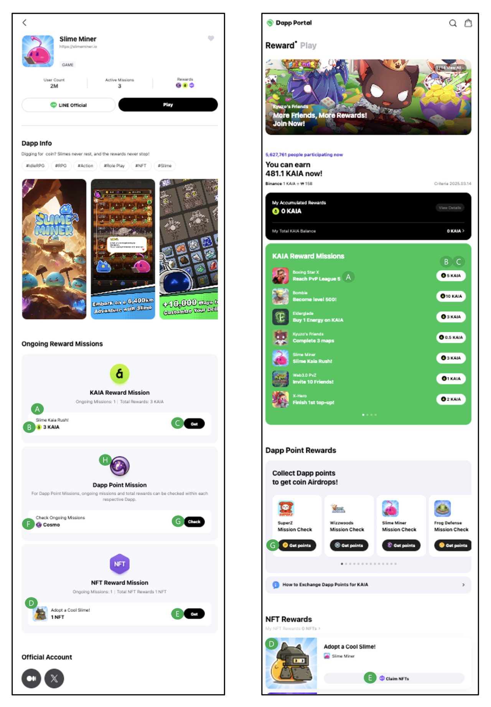

# Reward

**※ The distribution of Tokens (KAIA or USDT), NFTs, and Points based on specific condition fulfillment must be implemented directly within the Dapp, and only missions with these features fully implemented can be listed on the Dapp portal.&#x20;**<mark style="color:red;">**(NFT minting must be carried out exclusively through the Dapp portal)**</mark>

## 1) $Token(KAIA or USDT) Reward 

**Mission Name**

* Displayed in A of the Screen Sample
* The multilingual language support is: EN (English), JA (Japanese), TH (Thai), TW (Traditional Chinese). All the language must be filled.
* There is a 15-character limit

**Reward Amount per Mission**

* Displayed in B of the Screen Sample
* $Token(KAIA or USDT) Reward Distribution Amount

**Wallet Address**

* The from Address for the Mini Dapp to airdrop $KAIA.
* <mark style="color:red;">**If multiple events are held at the same time, Wallet Address is required for each event.**</mark>
* Contract Address are not allowed.

**Reward URL**

* Displayed in C of the Screen Sample
* Write URLs for two versions: LIFF and External Web

**Opened at/Closed\_at**

Please make sure to specify the exact time, including the minute

* ex) yyyy-mm-dd tt:mm (in UTC)

## 2) NFT Reward 

**Mission Name**

* Displayed in D of the Screen Sample
* The multilingual language support is: EN (English), JA (Japanese), TH (Thai), TW (Traditional Chinese). All the language must be filled.
* There is a 15-character limit.

**Wallet Address**

* The from Address for the Mini Dapp to airdrop NFT.

**Contract Address**

* The Collection contract address(or Collection name) of the NFT to be airdropped

**Reward URL**

* Displayed in C of the Screen Sample
* Write URLs for two versions: LIFF and External Web

**Opened at/Closed\_at**

Please make sure to specify the exact time, including the minute

* ex) yyyy-mm-dd tt:mm (in UTC)

## 3) Point Reward 

**Point Name**

* Displayed in F of the Screen Sample
* English Only

**Point Image**

* Displayed in G of the Screen Sample
* Image Size: (150x150) \* 2px

**API Endpoint**

* https://{dapp\_path}

**Reward URL**

* Displayed in H of the Screen Sample
* Write URLs for two versions: LIFF and External Web

**Opened at/Closed\_at**

Please make sure to specify the exact time, including the minute

* ex) yyyy-mm-dd tt:mm (in UTC)

<figure><figcaption></figcaption></figure>
