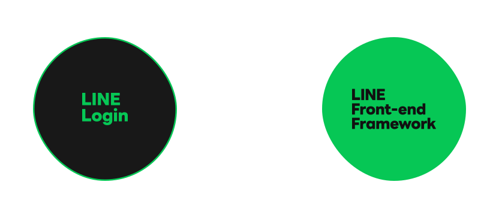
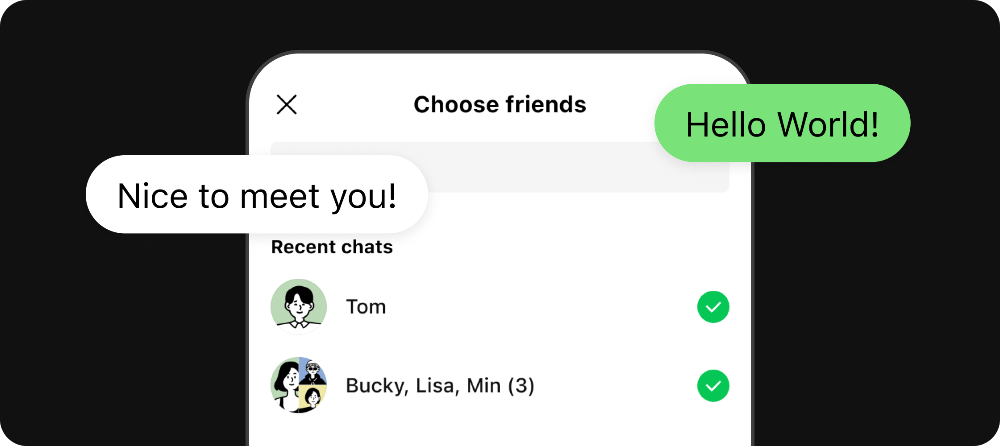
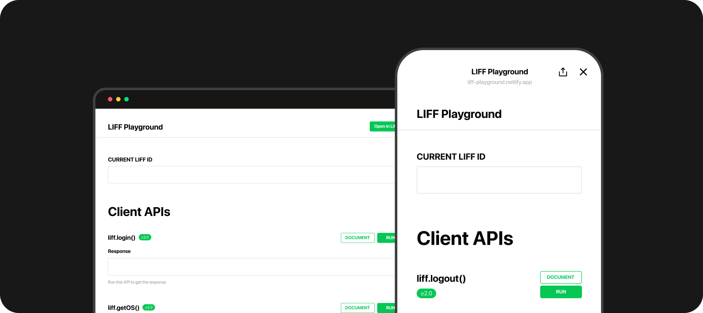
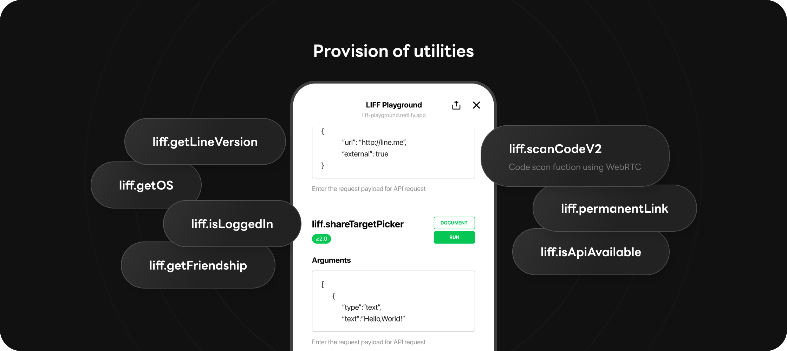
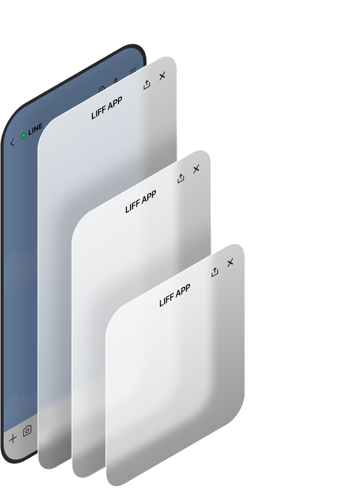

# LINE Front-end Framework (LIFF)

<mark style="color:red;">**Mini Dapp should build web application as LINE version with LIFF SDK.**</mark>

## Introduction

Official Document : [LINE Front-end Framework (LIFF)](https://developers.line.biz/en/docs/liff/overview/)

### Web app connecting with LINE users

The LINE Front-end Framework (LIFF) is a web application framework provided by LY Corporation. When you integrate the LIFF SDK into your web app, you will be able to access information provided by the LINE Platform or use functionalities provided by the LINE app.

### Integration with LINE Login and the LINE Platform

<figure><figcaption></figcaption></figure>

LIFF is integrated with LINE Login. Without having to deal with complicated settings, you can safely access a user's profile information via the LINE Platform's authorization flow.

### Share target picket: A powerful tool for sending messages

<figure><figcaption></figcaption></figure>

The share target picker is a tool for sending messages to LINE friends who you can select via LIFF app. Even without opening a chat room the developer can send messages to LINE friends, so you can use this feature to connect users with services, send information, and add social elements.

## Cross-browser support

<figure><figcaption></figcaption></figure>

LIFF is cross-browser compatible. Most APIs are compatible with desktop browsers, so they will work both with regular web browsers as well as with LINE apps.

## Providing utility

<figure><figcaption></figcaption></figure>

We're providing various convenient utilities to support LIFF developers. You can easily retrieve the LINE app's version or the OS type. We also provide a QR code reader out of the box.

## Various screen sizes

For running on the LINE app we're providing three different screen sizes that each have their own advantages.

<figure><figcaption></figcaption></figure>

