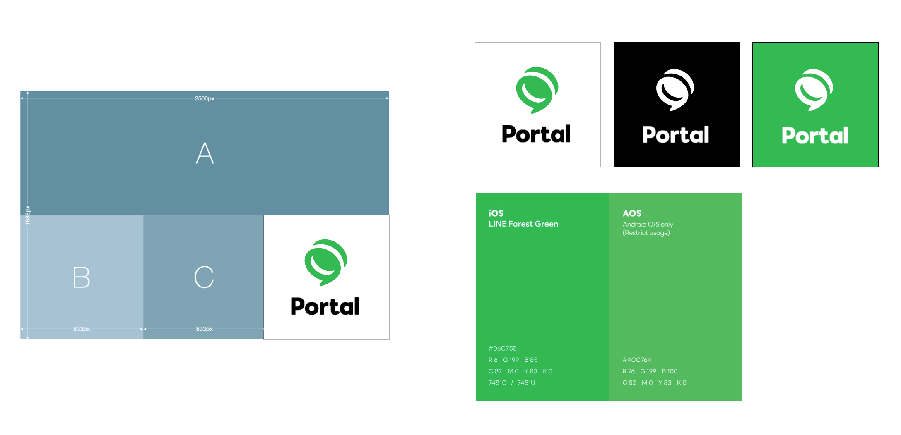
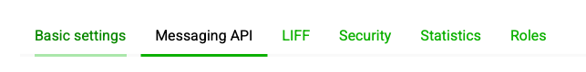
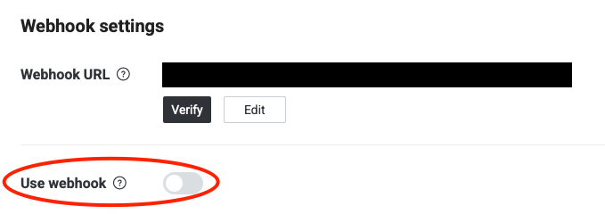

# Official Account

## Guide

See the [Create an Account | LINE for Business](https://www.linebiz.com/jp-en/other/) for detail information.

### Create OA as Unverified and Integrate it to Mini Dapp

* OA with unverified : It's an OA that does not need to get approval from separate LINE local entity.
* OA with verified : It's an OA approved from LINE local entities in Japan, Thailand, and Taiwan.
  * To establish a Verified Official Account, authorization from local legal entities is required; please be advised that the approval process may involve extended timelines.

### OA Profile (Required)

Use same concepts as the one of your Mini Dapp.

<figure><figcaption></figcaption></figure>

### Contents for OA

<figure><figcaption></figcaption></figure>

#### Welcome Message (Text)

Language

* Default: English (Since the OA channel is a public channel accessible to users from all countries, we request the messages to be set in English by default.)
* Optional: Japanese, Thai, Chinese
* You can send Welcome Message with various language as one chat

#### Welcome Message (Rich)

You can use Images or Videos with general text message. (CTA URL is required)

#### Rich Menu

Default language is English

#### Template

* Please create the rich menu images and set the URLs according to the template guide below.\
  This template is the optimal flow to encourage users to transition to Dapp. When creating the rich menu image, a clean and conversion-driven design is required.

<figure><figcaption></figcaption></figure>

<figure><figcaption></figcaption></figure>

* **A**
  * URL: Mini Dapp URL (LIFF)
* **B & C**
  * URL: Mini Dapp Social Channels, Website URL, etc.
* **D**
  * (Required) As an official LINE Mini Dapp, this section provides a path to the Dapp Portal and encourages cross-selling between Dapps.
  * **Image**: Mini Dapp Icon + Portal Wordmark (attached)
  * URL: [https://liff.line.me/2006533014-8gD06D64](https://liff.line.me/2006533014-8gD06D64) (Dapp Portal LIFF)
* Image Files







### Message

* If you want to send messages to specific users, use BOTs, or integrate OA with external services, you need to use the [Messages API](https://developers.line.biz/en/docs/messaging-api/). In this case, please see the attached Message API URL for reference.

### Recommendation) Operate Welcome Messages in Multiple Languages (Requires Additional Development)

* By implementing additional development, you can send welcome messages tailored to the user's language setting when they follow the OA channel. (Refer to the guide below for details.)

<table><thead><tr><th>Step</th><th width="697">Details</th></tr></thead><tbody><tr><td>1</td><td>Create an OA channel on LINE Developers.</td></tr><tr><td>2</td><td><ul><li>Implement an API to receive Webhook events for the OA channel (used in Step 8).</li><li>method : POST</li><li><strong>URL</strong>: Flexible</li><li>Refer to the <a href="https://developers.line.biz/en/docs/messaging-api/receiving-messages/#webhook-event-in-one-on-one-talk-or-group-chat">Webhook specifications</a>.</li><li><a href="https://developers.line.biz/en/docs/messaging-api/receiving-messages/#verify-signature">It is recommended to verify the Webhook signature.</a></li></ul></td></tr><tr><td>3</td><td>When a <a href="https://developers.line.biz/en/reference/messaging-api/#follow-event">Follow Event </a>is received via the Webhook, retrieve the <code>userId</code> from the request body.</td></tr><tr><td>4</td><td><ul><li>Use the retrieved <code>userId</code> to fetch the user’s language setting on LINE.</li><li>Use the channel access token issued from the Messaging API tab in LINE Developers.</li><li>Utilize the <a href="https://developers.line.biz/en/reference/messaging-api/#get-profile">Get Profile API</a> to retrieve the user’s language.</li></ul></td></tr><tr><td>5</td><td><ul><li>Create templates for OA messaging. Configure the necessary content in multiple languages for each locale and store the templates locally or in the cloud. Refer to the <a href="https://developers.line.biz/en/reference/messaging-api/#message-objects">Message Objects API</a> for template formatting.</li><li>
Example: For Korean and English support, save the templates as:
<ul><li>oa_ko.json </li><li>oa_en.json</li></ul></li></ul></td></tr><tr><td>6</td><td>Load the appropriate template based on the user's language retrieved in Step 4, and call the <a href="https://developers.line.biz/en/reference/messaging-api/#send-push-message">OA Send API</a>.</td></tr><tr><td>7</td><td>Access the <strong>Messaging API</strong> tab in LINE Developers. </td></tr><tr><td>8</td><td><ul><li>Set the API endpoint developed in Steps 1–6 as the Webhook URL.</li><li>Turn the <strong>Use Webhook</strong> option to ON.</li></ul>

</td></tr><tr><td>9</td><td>
From now on, whenever a user follows the OA, a welcome message will automatically be sent in the user’s language.

(*Please make sure to turn OFF the welcome message setting in the existing Official Account Manager.)
</td></tr></tbody></table>

### OA consent must be set right after Mini Dapp(LIFF) channel consent

* When a user connects to Mini Dapp(LIFF) for the first time, User must agree to the channel of Mini Dapp(LIFF). Channel consent is not created separately, it is created by default when the Mini Dapp is created as LIFF, and the consent process is shown to the user.
  * You can attach the Add OA Friends popup right after channel consent. Therefore, please refer to the following document to learn how to set up OA consent after channel consent. \
    <mark style="color:red;">**It is necessary to select the AGGRESIVE VERSION.**</mark>
  * How to set up OA Aggressive mode
    * Go to LINE Developers > LINE Login Channel > LIFF > Add friend option, and set it to On (aggressive).

<figure><figcaption></figcaption></figure>

<figure><figcaption></figcaption></figure>

## Official Account Subscription Plans

<figure><figcaption></figcaption></figure>

#### Note that this is the cost of operating one OA, and the cost of multiple OAs will adds up.

## LINE OpenChat

#### Openchat can be utilized for two-way communication outside of OA.

* OpenChat is only available to users in Japan, Thailand, and Taiwan.
* To create Open Chats in Japan, Thailand, and Taiwan, you'll need a LINE account for each country. For example, a Japanese account is required to create a Japanese Openchat.
* You can add a translation bot to OpenChat. You can only add one language and it is recommended to use a translation bot for your target country.
  * Example) When adding a Korean<>English bot, if a user posts a chat in Korean, the translation bot will automatically translate it to English. If the user posts in English, it will be automatically translated to Korean.

<figure><figcaption></figcaption></figure>
