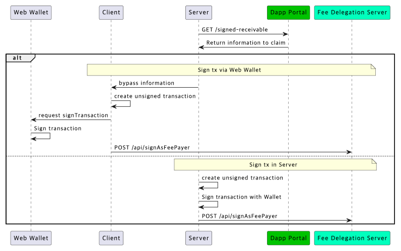

---
metaLinks:
  alternates:
    - >-
      https://app.gitbook.com/s/juuhQ1BuKwYKE7NR6geM/mini-dapp/mini-dapp-sdk/payment/policy/how-to-claim-usdt-for-stripe-transaction
---

# How to Claim USDT for STRIPE transaction

## Claim Process

<figure><figcaption></figcaption></figure>

The settlement of Stripe payment revenue follows the policy [here](../settlement.md).

1. Retrieve an information for creating **transaction** for the claim from the Dapp Portal.
2. Sign the transaction using the **address currently receiving Kaia-based settlements.**
3. Broadcast signed transaction.
   1. **If fee delegation is enabled**, transfer the signed transaction to the **Fee Payer Server.**
   2. **If fee delegation is not used**, broadcast the signed transaction **directly to a Kaia node.**


## API to retrieve information to create unsigned transaction

Request API to receive STRIPE payment revenue in USDT

### API Path

&#x20;<mark style="background-color:blue;">**get**</mark> /api/b2b-v1/dapp-settlements/{client\_id}/signed-receivable

<table><thead><tr><th width="194.8154296875"></th><th></th></tr></thead><tbody><tr><td>Domain</td><td>https://api.dappportal.io</td></tr><tr><td>Path</td><td>/api/b2b-v1/dapp-settlements/{client_id}/signed-receivable</td></tr></tbody></table>

### Authentication Information

This API requires Dapp Portal authentication.

Please include the following information in the request headers for authentication

<table><thead><tr><th width="252.3251953125">Name</th><th>Description</th></tr></thead><tbody><tr><td><strong>client_id</strong> <mark style="color:red;">*required</mark><br>string<br><em>(path)</em></td><td>Client identifier string (36 bytes) obtained from support team</td></tr><tr><td><strong>X-Auth-Client-Id</strong> <mark style="color:red;">*required</mark><br>string<br><em>(header)</em></td><td>Client identifier string (36 bytes) obtained from support team</td></tr><tr><td><strong>X-Auth-Timestamp</strong> <mark style="color:red;">*required</mark><br>string<br><em>(header)</em></td><td>Current time in Unix epoch format</td></tr><tr><td><strong>X-Auth-Salt</strong> <mark style="color:red;">*required</mark><br>string<br><em>(header)</em></td><td>Randomly generated UUID string (36 bytes)</td></tr><tr><td><strong>X-Auth-Signature</strong> <mark style="color:red;">*required</mark><br>string<br><em>(header)</em></td><td>(*) HMAC-based signature proving request authenticity</td></tr></tbody></table>

`(*) base64encode(hmac("{clientId}|GET|/api/b2b-v1/dapp-settlements/{clientId}/signed-receivable|{timestamp}|{salt}"))`

### Response

<table><thead><tr><th width="134.3388671875">field</th><th width="95.6796875">type</th><th>description</th><th>example</th></tr></thead><tbody><tr><td>transaction</td><td></td><td></td><td></td></tr><tr><td><ul><li>to</li></ul></td><td>String</td><td>contract address to call</td><td><code>"0xdce5..."</code></td></tr><tr><td><ul><li>value</li></ul></td><td>String</td><td>native token's amount to send</td><td><code>"0x0"</code></td></tr><tr><td><ul><li>data</li></ul></td><td>String</td><td>data of smart contract</td><td><code>"0x...."</code></td></tr></tbody></table>

<pre><code>{
<strong>  "receivable": {
</strong>    "claimer_id": "",
    "sequence_begin": "",
    "sequence_end": "",
    "vault_address": "",
    "recipient_address": "",
    "token_address": "",
    "amount": "",
    "deadline": ""
  },
  "signature": "",
  "transaction": {
    "to": "",
    "data": "",
    "value": ""
  }
}
</code></pre>

### Sample Code

Retrieve transaction executing load() function from Dapp Portal

```javascript
function toBase64(buffer) {
    const bytes = new Uint8Array(buffer);
    let binary = '';
    for (let b of bytes) {
        binary += String.fromCharCode(b);
    }
    return btoa(binary);
}
 
async function calcHmac(clientSecret, clientId, method, path, timestamp, salt) {
    const msg = `${clientId}|${method.toUpperCase()}|${path}|${timestamp}|${salt}`;
    const enc = new TextEncoder();
    const key = await crypto.subtle.importKey(
        'raw',
        enc.encode(clientSecret),
        {name: 'HMAC', hash: {name: 'SHA-256'}},
        false,
        ['sign'],
    );
    const sig = await crypto.subtle.sign('HMAC', key, enc.encode(msg));
    return toBase64(sig);
}
 
async function load(domain, clientId, clientSecret) {
    const request = {
        method: 'GET',
        path: `/api/b2b-v1/dapp-settlements/${clientId}/signed-receivable`,
        timestamp: Math.floor(Date.now() / 1000).toString(),
        salt: crypto.randomUUID()
    };
 
    // prepare the hmac
    const signature = await calcHmac(
        clientSecret,
        clientId,
        request.method,
        request.path,
        request.timestamp,
        request.salt,
    );
 
    // load the transaction
    const response = await fetch(
        `${domain}${request.path}`, {
            method: request.method,
            headers: {
                'X-Auth-Client-Id': clientId,
                'X-Auth-Timestamp': request.timestamp,
                'X-Auth-Salt': request.salt,
                'X-Auth-Signature': signature,
            },
        });
    return await response.json();
}
```

## Create and Sign Transaction

1. Create transaction with response from Dapp Portal.
   1. to, value, data
2. Sign the transaction using the address currently receiving Kaia-based settlements.
3. Broadcast signed transaction.
   1. **If fee delegation is enabled**, transfer the signed transaction to the **Fee Payer Server.**
      1. Domain: [https://fee-delegation.kaia.io](https://fee-delegation.kaia.io)
      2. Path: /api/signAsFeePayer
      3. POST (application/json)\
         { userSignedTx: {rawSignedTx} }
      4. Add `type: 49` while creating transaction to use fee delegation
   2. **If fee delegation is not used**, broadcast the signed transaction **directly to a Kaia node.**

### Sample Code

**⚠️** This sample code applies to cases where the **Kaia Wallet (Web Extension)** is used.

If you choose to sign the unsigned transaction (obtained via API) using a different method, please make sure to use the signing method appropriate for your chosen approach.

```bash
async function connect() {
    const provider = window.klaytn;
    await provider.request({
        method: 'klay_requestAccounts',
        params: [],
    });
}

#In case of broadcasting signed tx directly
async function claim(transaction) {
    // sign the transaction
    const provider = window.klaytn;
    const gasPrice = await provider.send('klay_gasPrice', []);
    const sufficientGas = '0x40000';
    const tx = {
        from: provider.selectedAddress,
        to: transaction.to,
        data: transaction.data,
        value: transaction.value,
        gasPrice: gasPrice.result,
        gas: sufficientGas,
    };
    return await provider.send('klay_sendTransaction', [tx]);
}
 
#In case of broadcasting signed tx wih fee delegation server
async function claimFeeDelegated(domain, transaction) {
    // sign the transaction
    const provider = window.klaytn;
    const gasPrice = await provider.send('klay_gasPrice', []);
    const sufficientGas = '0x40000';
    const tx = {
        type: 49,
        from: provider.selectedAddress,
        to: transaction.to,
        data: transaction.data,
        value: transaction.value,
        gasPrice: gasPrice.result,
        gas: sufficientGas,
    };
    const signedTx = await provider.send('klay_signTransaction', [tx]);
 
    // send the signed transaction to the fee delegation server
    const response = await fetch(`${domain}/api/signAsFeePayer`, {
        method: 'POST',
        headers: {
            'Content-Type': 'application/json',
        },
        body: JSON.stringify({
            userSignedTx: {raw: signedTx.result.rawTransaction},
        }),
    });
    return await response.json();
}
```

## Complete Example: From Claim to Broadcast

**⚠️** The example code provided is for illustrative purposes only. You should review and modify it appropriately to ensure it fits securely within your production environment.\
\
We do not take any responsibility for issues or damages caused by using this code as-is.

```bash
function toBase64(buffer) {
    const bytes = new Uint8Array(buffer);
    let binary = '';
    for (let b of bytes) {
        binary += String.fromCharCode(b);
    }
    return btoa(binary);
}
 
async function calcHmac(clientSecret, clientId, method, path, timestamp, salt) {
    const msg = `${clientId}|${method.toUpperCase()}|${path}|${timestamp}|${salt}`;
    const enc = new TextEncoder();
    const key = await crypto.subtle.importKey(
        'raw',
        enc.encode(clientSecret),
        {name: 'HMAC', hash: {name: 'SHA-256'}},
        false,
        ['sign'],
    );
    const sig = await crypto.subtle.sign('HMAC', key, enc.encode(msg));
    return toBase64(sig);
}
 
async function connect() {
    const provider = window.klaytn;
    await provider.request({
        method: 'klay_requestAccounts',
        params: [],
    });
}
 
async function load(domain, clientId, clientSecret) {
    const request = {
        method: 'GET',
        path: `/api/b2b-v1/dapp-settlements/${clientId}/signed-receivable`,
        timestamp: Math.floor(Date.now() / 1000).toString(),
        salt: crypto.randomUUID()
    };
 
    // prepare the hmac
    const signature = await calcHmac(
        clientSecret,
        clientId,
        request.method,
        request.path,
        request.timestamp,
        request.salt,
    );
 
    // load the transaction
    const response = await fetch(
        `${domain}${request.path}`, {
            method: request.method,
            headers: {
                'X-Auth-Client-Id': clientId,
                'X-Auth-Timestamp': request.timestamp,
                'X-Auth-Salt': request.salt,
                'X-Auth-Signature': signature,
            },
        });
    return await response.json();
}
 
async function claim(transaction) {
    // sign the transaction
    const provider = window.klaytn;
    const gasPrice = await provider.send('klay_gasPrice', []);
    const sufficientGas = '0x40000';
    const tx = {
        from: provider.selectedAddress,
        to: transaction.to,
        data: transaction.data,
        value: transaction.value,
        gasPrice: gasPrice.result,
        gas: sufficientGas,
    };
    return await provider.send('klay_sendTransaction', [tx]);
}
 
async function claimFeeDelegated(domain, transaction) {
    // sign the transaction
    const provider = window.klaytn;
    const gasPrice = await provider.send('klay_gasPrice', []);
    const sufficientGas = '0x40000';
    const tx = {
        type: 49,
        from: provider.selectedAddress,
        to: transaction.to,
        data: transaction.data,
        value: transaction.value,
        gasPrice: gasPrice.result,
        gas: sufficientGas,
    };
    const signedTx = await provider.send('klay_signTransaction', [tx]);
 
    // send the signed transaction to the fee delegation server
    const response = await fetch(`${domain}/api/signAsFeePayer`, {
        method: 'POST',
        headers: {
            'Content-Type': 'application/json',
        },
        body: JSON.stringify({
            userSignedTx: {raw: signedTx.result.rawTransaction},
        }),
    });
    return await response.json();
}
```


