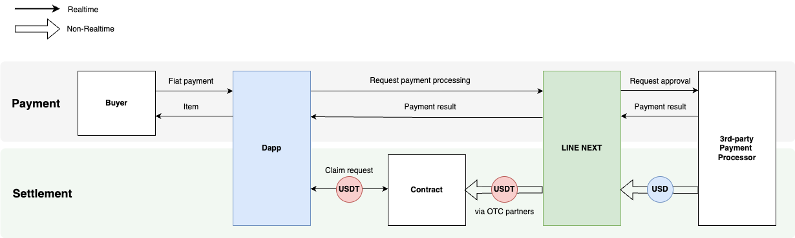
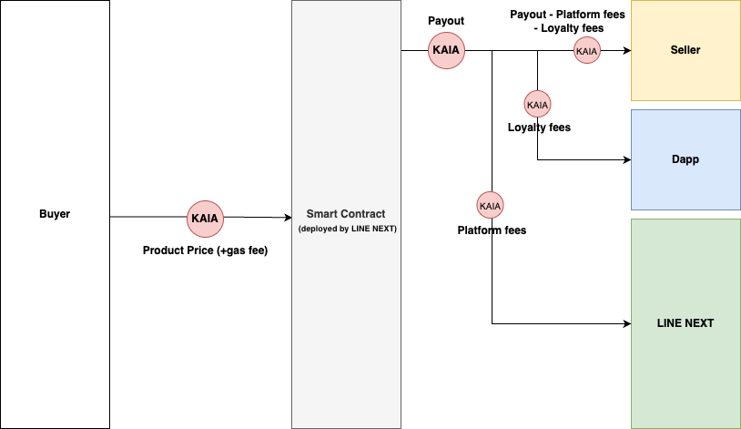

# Settlement

**The contents of this document are subject to change based on future circumstances or policy revisions.**

This guide provides an overview of the payment system offered by the Dapp Portal. \
It includes detailed information on payment policies, refund policies, and settlement policies.

## Cash Flow

* Product Price: Product sales amount
* Platform Fee (Service Fee): The fee LINE NEXT receives for providing the platform.
* Royalty Fee (Contents Fee): The fee that the Dapp receives as royalty for NFT C2C transactions.
* Payment Solution Fee: Payment fee collected by the payment processor for providing the payment solution.

## Mini Dapp in-app Items&#x20;

### 1-1. Fiat Payment (B2C)

Payout: Product Price - Platform Fee - Payment Solution Fee - All other costs\*

* All other costs: OTC conversion fee, etc.

<figure><figcaption></figcaption></figure>

### 1-2. Fiat Settlement

#### a. Settlement Currency

The settlement funds are paid in USDT based on Kaia blockchain

#### b. Settlement Frequency

Monthly settlement (payment of settlement funds in N+1 for transactions occurring during N)

#### c. Settlement Procedure

* The Payment Processor deducts transaction fees and confirms the settlement amount, then pays it to LINE NEXT (N+1 W1\~W2).
* LINE NEXT deducts platform fees and converts the remaining balance into USDT (N+1 W3).
* After deducting all related costs, Dapps can see the final settlement amount in the settlement report and claim directly to get paid. (N+1 W4).

#### d. Example

For payments made in March

* April W1\~W2: Payment Processor deducts the payment fee, finalizes the settlement amount, and sends it to LINE NEXT
* April W3: LINE NEXT deducts the platform fee and converts the remaining difference into crypto.
* April W4: Dapps can see the final settlement amount in the settlement report and claim directly to get paid.

#### e. Fiat Settlement Info

<table><thead><tr><th width="208.62353515625">Information</th><th>Description</th></tr></thead><tbody><tr><td>Currency for Settlement</td><td><a href="https://kaiascan.io/token/0xd077a400968890eacc75cdc901f0356c943e4fdb?tabId=tokenTransfer&#x26;page=1">USDT</a> (USD pegged stable coin based on Kaia blockchain)</td></tr><tr><td>Payout Cycle</td><td>Monthly (Paid in N -> Claim from N+1)</td></tr><tr><td>Settlement Operator</td><td>Mini Dapps can claim directly</td></tr><tr><td>How to Claim</td><td>
Starting from the settlement of STRIPE revenue for April to June, scheduled for the end of July 2025, the following system will be applied. From the July revenue settlement onward, the same monthly settlement structure will continue.

<ol><li>
<strong>Call the Claim API directly based on the</strong> <a href="policy/how-to-claim-usdt-for-stripe-transaction.md"><strong>provided guide</strong></a>
<ol><li>Usage instructions for the Claim API will be published in advance on the Mini Dapp Docs.</li><li>This will be applied starting with the settlement of April–June Fiat revenue at the end of July, and from August onward, monthly settlements will follow the same process.</li><li>A dedicated Claim page will also be provided in the future to allow easy claiming without the need for direct API integration.</li></ol></li><li><strong>USDT will be sent on-chain to the Mini Dapp's designated wallet address for revenue settlement.</strong></li></ol></td></tr><tr><td>Claimable Address</td><td>Address on onboarding contracts.  (Same with address for crypto settlement)</td></tr><tr><td>Withdrawal Deadline</td><td>Mini Dapp can freely withdraw once the withdrawal period begins.</td></tr></tbody></table>

### 2-1. KAIA Payment (B2C)

Payout: Product Price - Platform Fee

<figure><figcaption></figcaption></figure>

### 2-2. KAIA Settlement

#### a. Settlement Currency

The settlement funds are paid in crypto

#### b. Settlement Frequency

Real-time settlement

#### c. Settlement Procedure

* The smart contract automatically calculates the related fee amounts based on the Product Price and pays the balance to the seller.
* LINE NEXT provides a quarterly settlement report (N+3)

## NFTs

### 1. KAIA Payment (B2C)

Payout: Product Price - Platform Fee

* Platform Fee: Discounted fee rates available during promotional periods.

<figure><figcaption></figcaption></figure>

### 2. KAIA Payment (C2C)

Payout: Royalty fee\*

* Rate set directly by the Dapp within the range of 0\~10% of the Product Price.

<figure><figcaption></figcaption></figure>

### 3. KAIA Settlement for NFTs

It is instantly settled same as Mini Dapp in-app items.

