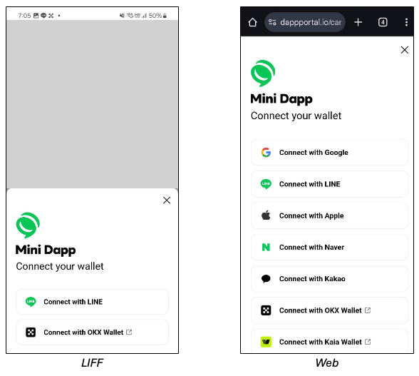

# v1.2.10

## Release Date

April 7th 2025 10:00 in UTC

## Note

NPM : [https://www.npmjs.com/package/@linenext/dapp-portal-sdk/v/1.2.10](https://www.npmjs.com/package/@linenext/dapp-portal-sdk/v/1.2.10)&#x20;

CDN : [https://static.kaiawallet.io/js/dapp-portal-sdk-1.2.10.js](https://static.kaiawallet.io/js/dapp-portal-sdk-1.2.10.js)

* UX has been improved for Wallet Connect

We have improved the user experience for Wallet Connect. By providing options for connecting Wallet Connect on a single screen, we have reduced the number of steps and also offer information about the recently used methods.

<figure><figcaption>
Dapp Portal
</figcaption></figure>

_**No code changes are needed to use this feature, but upgrading the Mini Dapp SDK is essential.**_

_**Upgrade the Mini Dapp SDK and provide the improved experience.**_
