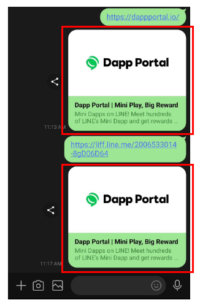

---
metaLinks:
  alternates:
    - https://app.gitbook.com/s/juuhQ1BuKwYKE7NR6geM/unifi-apps/design-guide
---

# 디자인 가이드

## 브라우저 탭 이름 설정

Unifi Apps 생태계의 가족 서비스임을 표시하기 위해 브라우저 탭 이름을 `이름 | Unifi Apps.` 형식으로 설정해 주십시오.

<figure><figcaption></figcaption></figure>## 오픈 그래프 설정

유니파이 앱의 LINE 미니 앱 및 LINE 로그인 LIFF/웹 URL은 다양한 마케팅 채널에서 활용될 수 있습니다. 오픈 그래프가 설정되지 않으면 콘텐츠 전달 효과가 저하될 수 있습니다. 따라서 오픈 그래프가 올바르게 구성되었는지 확인하십시오. 설정되지 않을 경우 링크가 표시되는 위치에 빈 공간이나 대체 텍스트가 나타날 수 있습니다.

<figure><figcaption></figcaption></figure>## 연결 버튼

구매, NFT 에어드롭, FT 에어드롭 등 특정 작업을 시작할 때 표준 버튼 대신 Wallet Connect가 통합된 경우, 해당 작업 실행 시 Wallet Connect가 트리거되도록 하십시오. 제공된 버튼 가이드라인에 따라 Wallet Connect를 시작하지 않아도 무방합니다. 다만 Wallet Connect와 유사한 버튼을 생성할 경우 반드시 상기 가이드라인을 준수해야 합니다.

<figure><figcaption></figcaption></figure>



## 팝업 창 z-index 설정

브라우저의 새 창을 차단하지 않도록 SDK 팝업 창의 z-index를 &#x27;999&#x27;로 설정합니다. 팝업 간 충돌을 방지하려면 모든 팝업 창의 z-index를 &#x27;999&#x27; 미만으로 설정하십시오.

