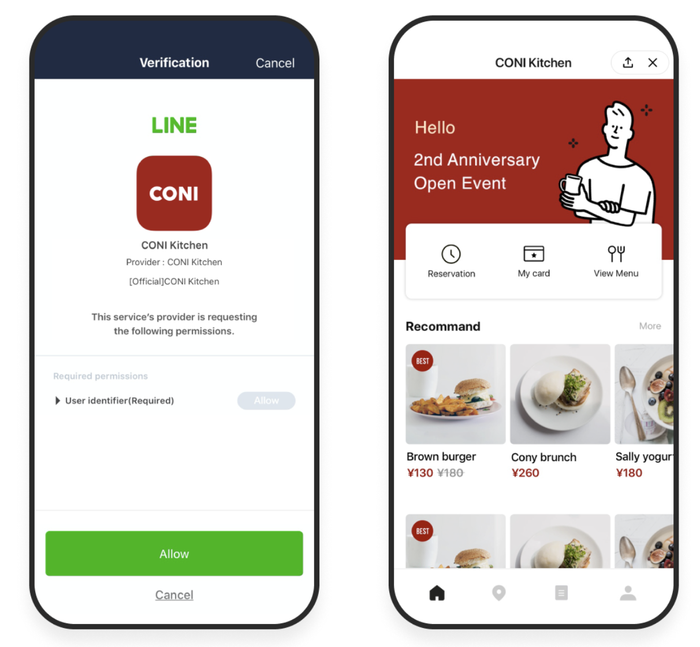
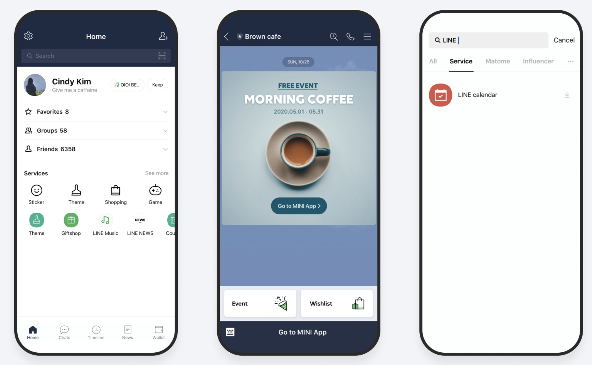
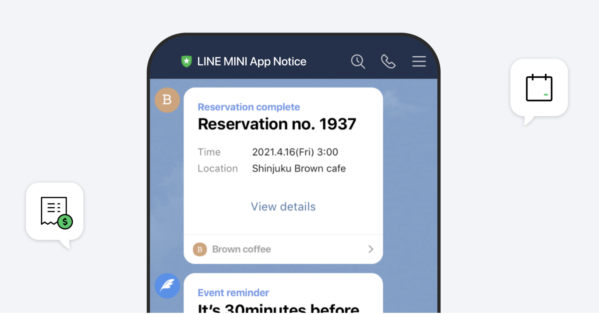
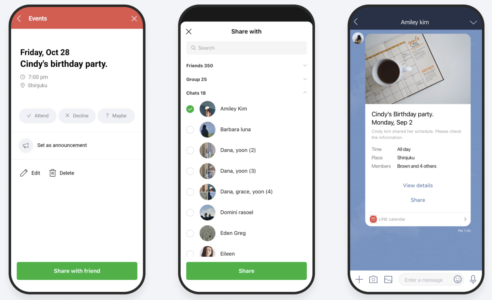

---
metaLinks:
  alternates:
    - https://app.gitbook.com/s/juuhQ1BuKwYKE7NR6geM/unifi-apps/line-integration
---

# LINE Integration

<mark style="color:red;">**Unifi Apps should build web application as LINE version with LIFF SDK.**</mark>

<mark style="color:red;">**The LINE version can be built as either a LINE MINI App or a LINE Login LIFF.**</mark>

## LINE MINI App

### Introduction

Official Document : [LINE MINI App](https://developers.line.biz/en/reference/line-mini-app/)

Utilize the advantages of LINE MINI App to provide the ultimate service experience to your users on LINE

### What is LINE MINI App?

<figure><figcaption></figcaption></figure>

LINE MINI App is a web application through which you can deliver services on LINE that meet various lifestyle needs of your users. Companies can utilize LINE MINI App’s advantages to provide users with a comfortable service experience, while gaining access to user data both online and offline.

### Simple service activation to help prevent user withdrawal

<figure><figcaption></figcaption></figure>

LINE MINI App is available on LINE, eliminating the need for downloading service apps or complicated registration processes. This minimizes service bounce rates and improves CVR.

### Quick access and repeated usage both inside and outside of LINE

<figure><figcaption></figcaption></figure>

LINE Mini Apps launch instantly from virtually anywhere. Access is supported through the LINE Home Tab, Official Accounts, and external channels like Web links and QR codes. This frictionless quick launch is the direct factor for increased user repeated usage.

### Easy to notify users of service-related information

<figure><figcaption></figcaption></figure>

Service Messages allow you to send critical, transactional notifications (e.g., order confirmations) free of charge, even if the user has not friended your Official Account.

### Easy to share with friends via LINE Talk

<figure><figcaption></figcaption></figure>

Users can share reservation information or coupons they acquired on LINE MINI App with their friends on LINE Talk, which further promotes your service.

## LINE Login LIFF

### Introduction

Official Document : [LINE Front-end Framework (LIFF)](https://developers.line.biz/en/docs/liff/overview/)

### Web app connecting with LINE users

The LINE Front-end Framework (LIFF) is a web application framework provided by LY Corporation. When you integrate the LIFF SDK into your web app, you will be able to access information provided by the LINE Platform or use functionalities provided by the LINE app.

### Integration with LINE Login and the LINE Platform

<figure><figcaption></figcaption></figure>

LIFF is integrated with LINE Login. Without having to deal with complicated settings, you can safely access a user's profile information via the LINE Platform's authorization flow.

### Share target picker: A powerful tool for sending messages

<figure><figcaption></figcaption></figure>

The share target picker is a tool for sending messages to LINE friends who you can select via LIFF app. Even without opening a chat room the developer can send messages to LINE friends, so you can use this feature to connect users with services, send information, and add social elements.

### Cross-browser support

<figure><figcaption></figcaption></figure>

LIFF is cross-browser compatible. Most APIs are compatible with desktop browsers, so they will work both with regular web browsers as well as with LINE apps.

### Providing utility

<figure><figcaption></figcaption></figure>

We offer various convenient utilities to support LIFF developers. You can easily retrieve information such as the LINE app's version or the device's OS type. Additionally, a QR code reader is provided out of the box.

### Various screen sizes

For running on the LINE app we're providing three different screen sizes that each have their own advantages.

<figure><figcaption></figcaption></figure>
