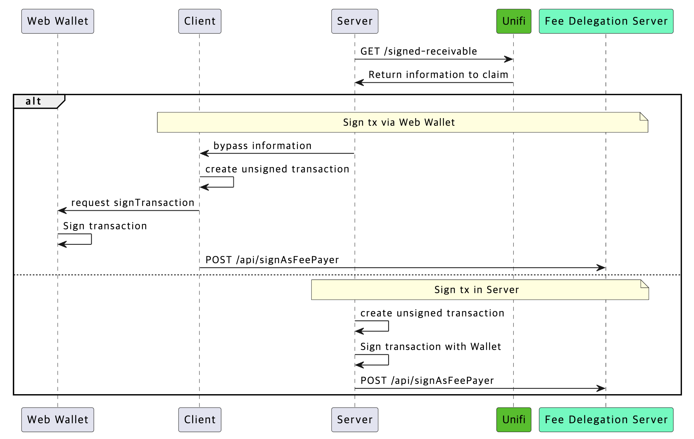

---
metaLinks:
  alternates:
    - >-
      https://app.gitbook.com/s/juuhQ1BuKwYKE7NR6geM/unifi-apps-sdk/payment-provider/settlement/how-to-claim-usdt-for-stripe-transaction
---

# STRIPE 거래에 대한 USDT 청구 방법

## 청구 절차

<figure><figcaption></figcaption></figure>Stripe 결제 수익 정산은 [여기](../../../mini-dapp/mini-dapp-sdk/payment/settlement.md)의 정책을 따릅니다.

1. Unifi에서 청구용 **거래** 생성 정보를 가져옵니다.
2. **현재 Kaia 기반 정산을 수령 중인 주소**로 거래에 서명합니다.
3. 서명된 거래를 브로드캐스트합니다.
   1. **수수료 위임이 활성화된 경우**, 서명된 거래를 **수수료 지불 서버(Fee Payer Server)**로 전송합니다.
   2. **수수료 위임을 사용하지 않는 경우**, 서명된 거래를 **Kaia 노드에 직접** 브로드캐스트합니다.

## 서명되지 않은 거래 생성 정보 조회 API

USDT로 STRIPE 결제 수익을 수령하기 위한 요청 API

### API

 <mark style="background-color:blue;">경로 **get**</mark>

/api/b2b-v1/dapp-settlements/{client\_id}/signed-receivable

<table><thead><tr><th width="194.8154296875"></th><th></th></tr></thead><tbody><tr><td>도메인</td><td>https://api.dappportal.io</td></tr><tr><td>경로</td><td>/api/b2b-v1/dapp-settlements/{client_id}/signed-receivable</td></tr></tbody></table>### 인증 정보

이 API는 Unifi 인증이 필요합니다.

인증용으로 요청 헤더에 다음 정보를 포함하십시오

<table><thead><tr><th width="252.3251953125">### 인증 정보  이 API는 Unifi 인증이 필요합니다.  인증용으로 요청 헤더에 다음 정보를 포함</th><th>설명</th></tr></thead><tbody><tr><td><strong>client_id</strong> <mark style="color:red;">*필수</mark><br>문자열<br><em>(경로)</em></td><td>지원팀으로부터 받은 클라이언트 식별자 문자열(36바이트)</td></tr><tr><td><strong>X-Auth-Client-Id</strong> <mark style="color:red;">*필수</mark><br>문자열<br><em>(헤더)</em></td><td>지원팀으로부터 받은 클라이언트 식별자 문자열(36바이트)</td></tr><tr><td><strong>X-Auth-Timestamp</strong> <mark style="color:red;">*필수</mark><br>문자열<br><em>(헤더)</em></td><td>유닉스 에포크 형식의 현재 시간</td></tr><tr><td><strong>X-Auth-Salt</strong> <mark style="color:red;">*필수</mark><br>문자열<br><em>(헤더)</em></td><td>무작위로 생성된 UUID 문자열(36바이트)</td></tr><tr><td><strong>X-Auth-Signature</strong> <mark style="color:red;">*필수</mark><br>문자열<br><em>(헤더)</em></td><td>(*) 요청의 진위성을 증명하는 HMAC 기반 서명</td></tr></tbody></table>`(*) base64encode(hmac(&quot;{clientId}|GET|/api/b2b-v1/dapp-settlements/{clientId}/signed-receivable|{timestamp}|{salt}&quot;))`

### 응답

<table><thead><tr><th width="134.3388671875">필드</th><th width="95.6796875">유형</th><th>설명</th><th>예시</th></tr></thead><tbody><tr><td>거래</td><td></td><td></td><td></td></tr><tr><td><ul><li>to</li></ul></td><td>문자열</td><td>호출할 계약 주소</td><td><code>&quot;0xdce5...&quot;</code></td></tr><tr><td><ul><li>값</li></ul></td><td>String</td><td>전송할 네이티브 토큰의 양</td><td><code>&quot;0x0&quot;</code></td></tr><tr><td><ul><li>데이터</li></ul></td><td>문자열</td><td>스마트 계약 데이터</td><td><code>&quot;0x....&quot;</code></td></tr></tbody></table>

<pre><code>{
<strong>  &quot;receivable&quot;: {
</strong>    &quot;claimer_id&quot;: &quot;&quot;,
    &quot;sequence_begin&quot;: &quot;&quot;,
    &quot;sequence_end&quot;: &quot;&quot;,
    &quot;vault_address&quot;: &quot;&quot;,
    &quot;recipient_address&quot;: &quot;&quot;,
    &quot;token_address&quot;: &quot;&quot;,
    &quot;amount&quot;: &quot;&quot;,
    &quot;deadline&quot;: &quot;&quot;
  },
  &quot;signature&quot;: &quot;&quot;,
  &quot;transaction&quot;: {
    &quot;to&quot;: &quot;&quot;,
    &quot;data&quot;: &quot;&quot;,
    &quot;value&quot;: &quot;&quot;
  }
}
</code></pre>

### 샘플 코드

Unifi에서 load() 함수를 실행하는 트랜잭션 조회.

```javascript
function toBase64(buffer) {
    const bytes = new Uint8Array(buffer);
    let binary = &#x27;&#x27;;
    for (let b of bytes) {
        binary += String.fromCharCode(b);
    }
    return btoa(binary);
}
 
async function calcHmac(clientSecret, clientId, method, path, timestamp, salt) {
    const msg = `${clientId}|${method.toUpperCase()}|${path}|${timestamp}|${salt}`;
    const enc = new TextEncoder();
    const key = await crypto.subtle.importKey(
        &#x27;raw&#x27;,
        enc.encode(clientSecret),
        {name: &#x27;HMAC&#x27;, hash: {name: &#x27;SHA-256&#x27;}},
        false,
        [&#x27;sign&#x27;],
    );
    const sig = await crypto.subtle.sign(&#x27;HMAC&#x27;, key, enc.encode(msg));
    return toBase64(sig);
}
 
async function load(domain, clientId, clientSecret) {
    const request = {
        method: &#x27;GET&#x27;,
        path: `/api/b2b-v1/dapp-settlements/${clientId}/signed-receivable`,
        timestamp: Math.floor(Date.now() / 1000).toString(),
        salt: crypto.randomUUID()
    };
 
    // hmac 준비
    const signature = await calcHmac(
        clientSecret,
        clientId,
        request.method,
        request.path,
        request.timestamp,
        request.salt,
    );
 
    // 트랜잭션 로드
    const response = await fetch(
        `${domain}${request.path}`, {
            method: request.method,
            headers: {
                &#x27;X-Auth-Client-Id&#x27;: clientId,
                &#x27;X-Auth-Timestamp&#x27;: request.timestamp,
                &#x27;X-Auth-Salt&#x27;: request.salt,
                &#x27;X-Auth-Signature&#x27;: signature,
            },
        });
    return await response.json();
}
```

## 트랜잭션 생성 및 서명

1. Unifi 응답으로 트랜잭션 생성.
   1. 수신자, 금액, 데이터
2. Kaia 기반 정산을 수신 중인 주소로 트랜잭션 서명.
3. 서명된 트랜잭션 브로드캐스트.
   1. **수수료 위임이 활성화된 경우**, 서명된 트랜잭션을 **수수료 지불 서버**로 전송.
      1. 도메인: [https://fee-delegation.kaia.io](https://fee-delegation.kaia.io)
      2. 경로: /api/signAsFeePayer
      3. POST (application/json)\
         { userSignedTx: {rawSignedTx} }
      4. 수수료 위임을 사용하려면 트랜잭션 생성 시 `type: 49`를 추가하십시오.
   2. **수수료 위임을 사용하지 않는 경우**, 서명된 트랜잭션을 **Kaia 노드에 직접** 브로드캐스트하십시오.

### 샘플 코드

**⚠️** 이 샘플 코드는 **Kaia Wallet (웹 확장 프로그램)**을 사용하는 경우에 적용됩니다.

API를 통해 획득한 서명되지 않은 트랜잭션을 다른 방법으로 서명하기로 선택한 경우, 선택한 접근 방식에 적합한 서명 방법을 사용해야 합니다.

```bash
async function connect() {
    const provider = window.klaytn;
    await provider.request({
        method: &#x27;klay_requestAccounts&#x27;,
        params: [],
    });
}

#직접 서명된 트랜잭션 브로드캐스팅 시
async function claim(transaction) {
    // 트랜잭션 서명
    const provider = window.klaytn;
    const gasPrice = await provider.send(&#x27;klay_gasPrice&#x27;, []);
    const sufficientGas = &#x27;0x40000&#x27;;
    const tx = {
        from: provider.selectedAddress,
        to: transaction.to,
        data: transaction.data,
        value: transaction.value,
        gasPrice: gasPrice.result,
        gas: sufficientGas,
    };
    return await provider.send(&#x27;klay_sendTransaction&#x27;, [tx]);
}
 
#수수료 위임 서버를 통해 서명된 트랜잭션 브로드캐스팅 시
async function claimFeeDelegated(domain, transaction) {
    // 트랜잭션 서명
    const provider = window.klaytn;
    const gasPrice = await provider.send(&#x27;klay_gasPrice&#x27;, []);
    const sufficientGas = &#x27;0x40000&#x27;;
    const tx = {
        type: 49,
        from: provider.selectedAddress,
        to: transaction.to,
        data: transaction.data,
        value: transaction.value,
        gasPrice: gasPrice.result,
        gas: sufficientGas,
    };
    const signedTx = await provider.send(&#x27;klay_signTransaction&#x27;, [tx]);
 
    // 서명된 트랜잭션을 수수료 위임 서버로 전송
    const response = await fetch(`${domain}/api/signAsFeePayer`, {
        method: &#x27;POST&#x27;,
        headers: {
            &#x27;Content-Type&#x27;: &#x27;application/json&#x27;,
        },
        body: JSON.stringify({
            userSignedTx: {raw: signedTx.result.rawTransaction},
        }),
    });
    return await response.json();
}
```

## 전체 예시: 클레임에서 브로드캐스트까지

**⚠️** 제공된 예제 코드는 설명 목적으로만 사용됩니다. 실제 운영 환경에서 안전하게 적용될 수 있도록 검토 및 수정해야 합니다.\
\
본 코드를 그대로 사용함으로써 발생하는 문제나 손해에 대해 당사는 어떠한 책임도 지지 않습니다.

```bash
function toBase64(buffer) {
    const bytes = new Uint8Array(buffer);
    let binary = &#x27;&#x27;;
    for (let b of bytes) {
        binary += String.fromCharCode(b);
    }
    return btoa(binary);
}
 
async function calcHmac(clientSecret, clientId, method, path, timestamp, salt) {
    const msg = `${clientId}|${method.toUpperCase()}|${path}|${timestamp}|${salt}`;
    const enc = new TextEncoder();
    const key = await crypto.subtle.importKey(
        &#x27;raw&#x27;,
        enc.encode(clientSecret),
        {name: &#x27;HMAC&#x27;, hash: {name: &#x27;SHA-256&#x27;}},
        false,
        [&#x27;sign&#x27;],
    );
    const sig = await crypto.subtle.sign(&#x27;HMAC&#x27;, key, enc.encode(msg));
    return toBase64(sig);
}
 
async function connect() {
    const provider = window.klaytn;
    await provider.request({
        method: &#x27;klay_requestAccounts&#x27;,
        params: [],
    });
}
 
async function load(domain, clientId, clientSecret) {
    const request = {
        method: &#x27;GET&#x27;,
        path: `/api/b2b-v1/dapp-settlements/${clientId}/signed-receivable`,
        timestamp: Math.floor(Date.now() / 1000).toString(),
        salt: crypto.randomUUID()
    };
 
    // hmac 준비
    const signature = await calcHmac(
        clientSecret,
        clientId,
        request.method,
        request.path,
        request.timestamp,
        request.salt,
    );
 
    // 트랜잭션 로드
    const response = await fetch(
        `${domain}${request.path}`, {
            method: request.method,
            headers: {
                &#x27;X-Auth-Client-Id&#x27;: clientId,
                &#x27;X-Auth-Timestamp&#x27;: request.timestamp,
                &#x27;X-Auth-Salt&#x27;: request.salt,
                &#x27;X-Auth-Signature&#x27;: signature,
            },
        });
    return await response.json();
}
 
async function claim(transaction) {
    // 트랜잭션 서명
    const provider = window.klaytn;
    const gasPrice = await provider.send(&#x27;klay_gasPrice&#x27;, []);
    const sufficientGas = &#x27;0x40000&#x27;;
    const tx = {
        from: provider.selectedAddress,
        to: transaction.to,
        data: transaction.data,
        value: transaction.value,
        gasPrice: gasPrice.result,
        gas: sufficientGas,
    };
    return await provider.send(&#x27;klay_sendTransaction&#x27;, [tx]);
}
 
async function claimFeeDelegated(domain, transaction) {
    // 트랜잭션 서명
    const provider = window.klaytn;
    const gasPrice = await provider.send(&#x27;klay_gasPrice&#x27;, []);
    const sufficientGas = &#x27;0x40000&#x27;;
    const tx = {
        type: 49,
        from: provider.selectedAddress,
        to: transaction.to,
        data: transaction.data,
        value: transaction.value,
        gasPrice: gasPrice.result,
        gas: sufficientGas,
    };
    const signedTx = await provider.send(&#x27;klay_signTransaction&#x27;, [tx]);
 
    // 서명된 트랜잭션을 수수료 위임 서버로 전송
    const response = await fetch(`${domain}/api/signAsFeePayer`, {
        method: &#x27;POST&#x27;,
        headers: {
            &#x27;Content-Type&#x27;: &#x27;application/json&#x27;,
        },
        body: JSON.stringify({
            userSignedTx: {raw: signedTx.result.rawTransaction},
        }),
    });
    return await response.json();
}
```
