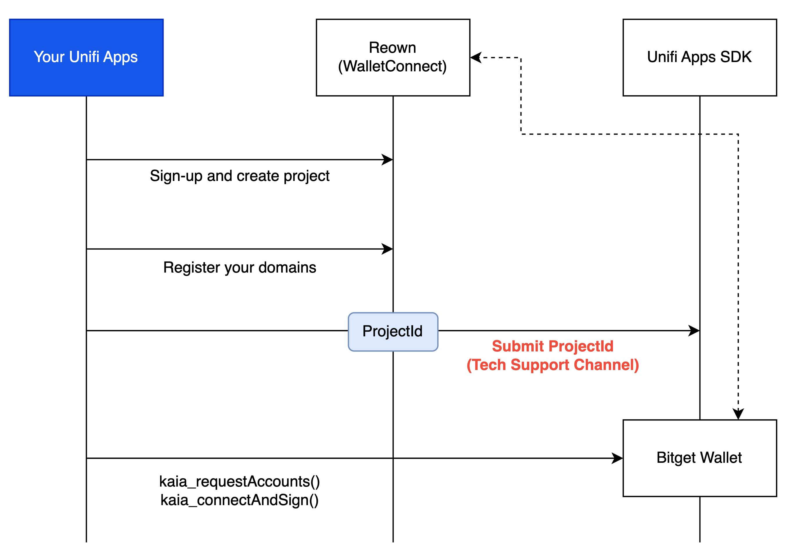

---
metaLinks:
  alternates:
    - >-
      https://app.gitbook.com/s/juuhQ1BuKwYKE7NR6geM/unifi-apps-sdk/wallet-provider/domain-verification-via-reown
---

# Domain Verification via Reown

## Unifi Apps SDK를 사용한 Bitget Wallet 통합 방법

<figure><figcaption></figcaption></figure>

Unifi Apps SDK는 WalletConnect를 통해 Bitget Wallet을 제공합니다. Unifi Apps SDK로 Bitget Wallet을 제공하려면 WalletConnect에서 요구하는 도메인 인증을 사전에 완료해야 합니다.

아래 가이드에 따라 도메인 인증을 완료하고 Reown에서 생성된 `ProjectId`를 Unifi 팀에 공유해 주십시오.

Bitget Wallet을 지원하는 Unifi Apps SDK 버전은 <mark style="color:$primary;">2025년</mark>
  <mark style="color:$primary;">5월</mark>
  출시 예정이며, 정확한 일정은 추후 공지됩니다.

:exclamation:<mark style="color:red;">**Bitget 연동을 지원하는 SDK 버전으로 업그레이드하더라도, 도메인 등록 및 ProjectId 제출이 완료되지 않으면 Bitget Wallet을 사용할 수 없습니다.**</mark>

### 참고 자료.

* [https://docs.reown.com/cloud/verify](https://docs.reown.com/cloud/verify)
* 도메인은 프로토콜 포함 전체(`http://` | `https://`)로 등록해야 합니다.
* 레코드 등록 시 도메인 끝에 슬래시(/)가 포함되지 않도록 주의하세요.
  * <mark style="color:$success;">올바른 예</mark>
  : https://unifi.io
  * <mark style="color:red;">잘못된 예</mark>
  :   https://unifi.io/ 

### 1.  Reown 대시보드 접속 및 인증 시작

* 대시보드를 통해 Reown 계정에 로그인하세요. ([https://dashboard.reown.com/](https://dashboard.reown.com/))
* 도메인 탭으로 이동
* 허용 목록에 추가할 도메인 입력

### 2. Unifi 팀에 ProjectId 제출

* 검증 완료 후 `ProjectId`를 제출하여 Unifi Apps SDK에 추가하세요.
* 텔레그램: <mark style="color:blue;">**@dappportal\_official**</mark>
  * 다른 경로로 기술 지원 채널을 이용 중이라면 해당 채널을 통해 `ProjectId`를 공유할 수 있습니다.
