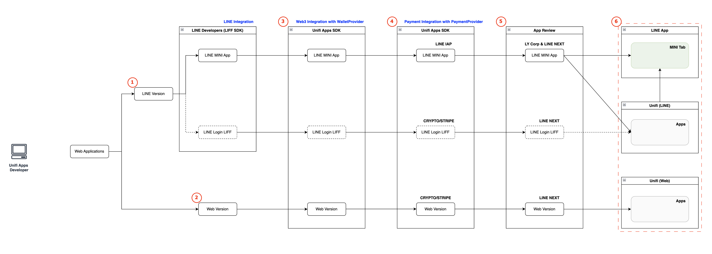

# Unifi Apps

## How to build Unifi Apps?

<figure><figcaption></figcaption></figure>

This guide explains the required integration architecture and the sequential steps for deploying Unifi Apps across LINE and Web environments.

\
Please follow each step based on the specific platform or integration type you plan to support.

### ① LINE Version Development — LIFF SDK Integration

Unifi Apps can provide a LINE-based experience in two ways:&#x20;

* LINE MINI App
* LINE Login LIFF

Both run inside the LINE mobile app and are implemented using the **LIFF SDK**, but they use different channel types and are onboarded through different tracks.

#### Key Differences

| Item                 | LINE MINI App                                                              | LINE Login LIFF                                                                              |
| -------------------- | -------------------------------------------------------------------------- | -------------------------------------------------------------------------------------------- |
| Channel              | LINE MINI App Channel                                                      | LINE Login Channel                                                                           |
| App Store policy     | Compliance with App Store policies                                         | -                                                                                            |
| LIFF SDK Usage       | Yes                                                                        | Yes                                                                                          |
| Unifi Apps SDK Usage | <ul><li>Yes</li><li>WalletProvider</li><li>PaymentProvider (IAP)</li></ul> | <ul><li>Yes</li><li>WalletProvider</li><li>PaymentProvider (Crypto/Stripe Fiat)</li></ul> |

📌 Refer to [**LINE Integration**](../mini-dapp/line-integration/) documentation for detailed instructions.\
📌 LINE MINI App and LINE Login LIFF are technically implemented by first integrating the Unifi Apps SDK into a base Web service, and then adding the LIFF SDK on top of it.\
Therefore, the Web and Unifi Apps SDK environment is inherently included from a technical perspective.

### ② Web Version Development

Development of a **web browser version** for Non-LINE users is **recommended**.

To support the following features, the **Unifi Apps SDK must be integrated** into the web version:

* **WalletProvider**
* **PaymentProvider (Crypto / Stripe Fiat)**

### ③ Web3 Integration (WalletProvider)

Unifi Apps SDK enables wallet features such as account creation and ownership verification.

| Version         | Supported Wallet Types                                                                     |
| --------------- | ------------------------------------------------------------------------------------------ |
| LINE MINI App   | <ul><li>LINE (Liff)</li><li>OKX, Bitget Wallet</li></ul>                                   |
| LINE Login LIFF | <ul><li>LINE (Liff)</li><li>OKX, Bitget Wallet</li></ul>                                   |
| Web             | <ul><li>Social Login (Web)</li><li>Kaia Wallet App/Extension, OKX, Bitget Wallet</li></ul> |

📌 Refer to [**Wallet Provider**](../mini-dapp/mini-dapp-sdk/wallet/) documentation for detailed instructions.

### ④ Payment Integration (PaymentProvider)

To support monetization, all Unifi Apps **must provide in-app item purchases**.

| Version         | Supported Payment Methods       |
| --------------- | ------------------------------- |
| LINE MINI App   | IAP payments                    |
| LINE Login LIFF | Crypto & Stripe (Fiat) payments |
| Web             | Crypto & Stripe (Fiat) payments |

📌 Refer to [Payment Provider](../mini-dapp/mini-dapp-sdk/payment/) documentation for detailed instructions.

### ⑤ App Review — Quality & Compliance Check

Submission and review providers vary by version:

<table><thead><tr><th width="166.32421875">Version</th><th>Demo Submission/Review Authority</th></tr></thead><tbody><tr><td>LINE MINI App</td><td><ul><li>LINE NEXT (Pre-review)</li><li>LY (Final approval)</li><li>Submission to LY is required <strong>after LINE NEXT review is completed</strong></li></ul></td></tr><tr><td>LINE Login LIFF</td><td><ul><li>LINE NEXT</li><li>Submission via email</li></ul></td></tr><tr><td>Web</td><td><ul><li>LINE NEXT</li><li>Submission via email</li></ul></td></tr></tbody></table>

### ⑥ Onboarding & Launch

<table><thead><tr><th width="160.8515625">Version</th><th>Featured Placement</th><th>Exposure Area</th><th>Served Users</th></tr></thead><tbody><tr><td>LINE MINI App</td><td>LINE App &#x26; Unifi</td><td><ul><li>MINI Tab in LINE App</li><li>Apps in Unifi</li></ul></td><td>Japan LINE Users</td></tr><tr><td>LINE Login LIFF</td><td>Unifi</td><td>Apps in Unifi</td><td>Global LINE Users</td></tr><tr><td>Web</td><td>Unifi</td><td>Apps in Unifi</td><td>Global Users</td></tr></tbody></table>

Additionally, if you register your information through a separate track, you may be featured on the Unifi and also sell NFTs.
