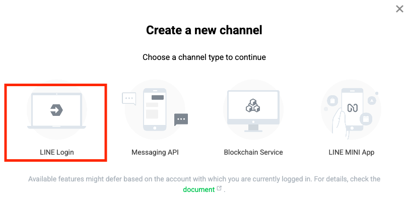
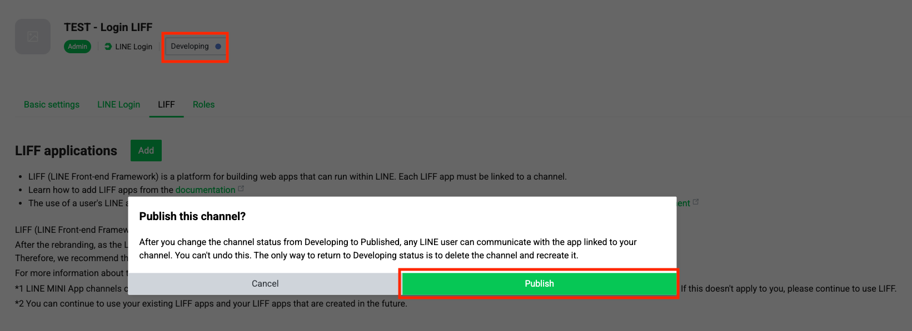

# LINE Login LIFF



## [Create LINE Business ID & Sign in to LINE Developers](https://developers.line.biz/en/)

* Sign in using your personal LINE account or email
* Create a Business ID to access LINE Developers Console

<figure><figcaption></figcaption></figure>



## [Register Developer Information](https://developers.line.biz/en/docs/line-developers-console/login-account/#register-as-developer)

* Add Developer Name and Email

<figure><figcaption></figcaption></figure>



## [Create a Provider](https://developers.line.biz/en/docs/liff/getting-started/#step-one-create-provider)

* Enter **Provider Name**
* Create the provider



## [Create a LINE Login Channel](https://developers.line.biz/en/docs/liff/getting-started/#step-one-create-provider)

<figure><figcaption></figcaption></figure>

| Field                                | Value                               |
| ------------------------------------ | ----------------------------------- |
| Region to provide the service        | Select target service country       |
| Company or owner’s country or region | Select the legal entity country     |
| Channel name                         | Enter Unifi Apps name               |
| Channel description                  | Provide a brief service description |
| App types                            | Select **Web app**                  |

<figure><figcaption></figcaption></figure>



## [Create a LIFF](https://developers.line.biz/en/docs/liff/registering-liff-apps/#registering-liff-app)

> Location: LINE Developers → Provider → LINE Login Channel → **LIFF** tab → Add

| Field             | Value                                     |
| ----------------- | ----------------------------------------- |
| LIFF app name     | Enter Unifi Apps name                     |
| Size              | Full                                      |
| Endpoint URL      | Enter Unifi Apps URL                      |
| Scopes            | `openid` (required), `profile` (optional) |
| Add friend option | On (Normal)                               |

<figure><figcaption></figcaption></figure>



## [Create a Messaging API Channel & LINE Official Account (Required for OA linking)](https://developers.line.biz/en/docs/messaging-api/getting-started/#create-oa-line-business-id)

> Location: LINE Developers → Provider → Create a new Channel → **Messaging API**

<figure><figcaption></figcaption></figure>

Configure the following:

* SMS verification: text message
* Account name: Unifi Apps name
* Email address: Representative email
* Legal entity country/region
* Company name: legal entity name
* Industry: Select main & sub category

<figure><figcaption></figcaption></figure>



## [Enable Messaging API for the LINE Official Account](https://developers.line.biz/en/docs/messaging-api/getting-started/#using-oa-manager)

> Location: LINE Official Account → **Settings → Enable Messaging API → Select Provider**

<figure><figcaption></figcaption></figure>



## Link LINE Official Account with LINE Login Channel

> Location: LINE Developers → Provider → LINE Login Channel → **Basic settings** →\
> Add friend option → Linked LINE Official Account → Edit → Select Created OA

<figure><figcaption></figcaption></figure>



## Publish Your LINE Login LIFF (Production)

> Location: LINE Developers → Provider → LINE Login Channel → **Developing → Publish**

LIFF must be published in Production for demo submission.

When in _Developing_ status, access to LIFF is restricted and demo review cannot proceed.

<figure><figcaption></figcaption></figure>



