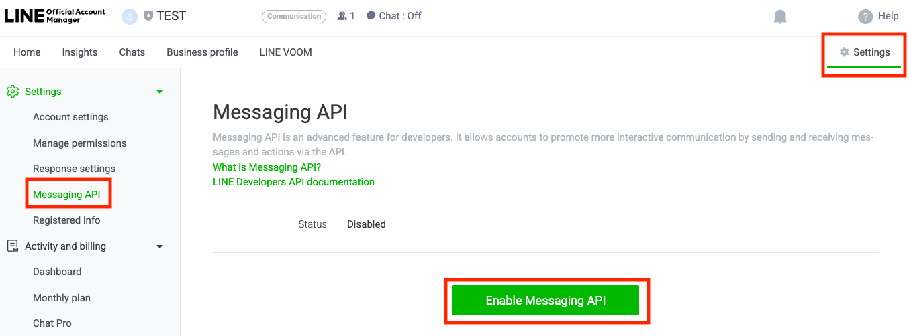

# LINE MINI App

## LINE MINI App Onboarding Requirements

* LINE MINI App onboarding is available **only for companies with a Japanese Corporate Number** or **individual business owners residing in Japan**.
* Global builders that wishing to onboard a MINI App must discuss the process separately with **LINE NEXT**.
* [LINE MINI App Policy >](https://terms2.line.me/LINE_MINI_App?lang=en)



## [Create LINE Business ID & Sign in to LINE Developers](https://developers.line.biz/en/)

* Sign in using your personal LINE account or email
* Create a Business ID to access LINE Developers Console

<figure><figcaption></figcaption></figure>



## [Register Developer Information](https://developers.line.biz/en/docs/line-developers-console/login-account/#register-as-developer)

* Add Developer Name and Email

<figure><figcaption></figcaption></figure>



## [Create a Provider](https://developers.line.biz/en/docs/liff/getting-started/#step-one-create-provider)

* Enter **Provider Name**
* Create the provider



## [Create a LINE MINI App](https://developers.line.biz/en/docs/line-mini-app/discover/console-guide/)

⚠️ **If you choose to deploy both LINE MINI App and LINE Login LIFF, please create both channels under the same LINE Provider.**\
When channels are created under the same Provider, the user’s **LINE UID remains consistent across channels**, which enables reliable user tracking and analytics.

<figure><figcaption></figcaption></figure>

| Field                         | Value                               |
| ----------------------------- | ----------------------------------- |
| Region to provide the service | Select target service country       |
| Channel name                  | Enter Unifi Apps name               |
| Channel description           | Provide a brief service description |

<figure><figcaption></figcaption></figure>



## Basic settings

> Location: LINE Developers → Provider → LINE MINI App Channel → Basic settings

| Field              | Value                                                                                                                                                                                            |
| ------------------ | ------------------------------------------------------------------------------------------------------------------------------------------------------------------------------------------------ |
| Channel icon       | Upload a 130×130px image                                                                                                                                                                         |
| Privacy policy URL | <ul><li>Enter the Unifi Apps privacy policy URL</li><li>Privacy Policy URL must belong to a <strong>corporate domain</strong>.</li></ul>                                                         |
| Localization       | <ul><li>Enter at least three languages (EN, JP required)</li><li>Localization content that is unclear or ambiguous is frequently rejected. Ensure the service description is accurate.</li></ul> |

<figure><figcaption></figcaption></figure>



## Web app settings

> Location: LINE Developers → Provider → LINE MINI App Channel → Web app settings

| Field             | Value                                                                                 |
| ----------------- | ------------------------------------------------------------------------------------- |
| Endpoint URL      | <ul><li>Enter Unifi Apps URL</li><li>development / review / production URLs</li></ul> |
| Scopes            | `openid` (required), `profile` (optional)                                             |
| Add friend option | On (Normal)                                                                           |

<figure><figcaption></figcaption></figure>



## Business information

| Field                           | Value                                                                                  |
| ------------------------------- | -------------------------------------------------------------------------------------- |
| Customer support page URL       | CS inquiry page                                                                        |
| Customer support email address  | CS email                                                                               |
| LINE Official Account ID        | Available after Step 11                                                                |
| Service company name            | Legal entity or business owner name                                                    |
| Service company type            | corporate / self-employed                                                              |
| Certificate document            | Business registration certificate                                                      |
| Identification document         | Representative’s ID                                                                    |
| Website URL                     | Official service website                                                               |
| Email address                   | Corporate domain email                                                                 |
| Development company information | Enter separately if different from service owner (or select “same as service company”) |

<figure><figcaption></figcaption></figure>



## Contact information

| Field                  | Value                                                                                             |
| ---------------------- | ------------------------------------------------------------------------------------------------- |
| First Name / Last Name | Person in charge                                                                                  |
| Email address          | Corporate domain email (review results & notices will be sent here)                               |
| Phone Number           | Phone number of the person in charge                                                              |
| Company name           | Service owner (legal entity)                                                                      |
| Company address        | Registered business address                                                                       |
| Registration number    | <ul><li>Corporate: Corporate Number</li><li>Sole proprietor: <code>0000000000000</code></li></ul> |

<figure><figcaption></figcaption></figure>



## [Create a Messaging API Channel & LINE Official Account (Required for OA linking)](https://developers.line.biz/en/docs/messaging-api/getting-started/#create-oa-line-business-id)

> Location: Provider → Create a new Channel → Messaging API → Create a LINE Official Account

⚠ The interface is **only available in Japanese**, as MINI App is for Japan.

<figure><figcaption></figcaption></figure>

Configure the following:

* SMS verification (text message)
* **アカウント名**: Unifi Apps name
* **メールアドレス**: Representative email
* **会社・事業者の所在国・地域**: Select the country
* **会社・事業者名**: Legal entity name
* **業種**: Select main & sub industry
* **運用目的（複数選択可）**: Select applicable purposes
* **主な使い方**: Select usage type
* **ビジネスマネージャーの組織との接続方法**: Select appropriate option

<figure><figcaption></figcaption></figure>



## [Enable Messaging API for the LINE Official Account](https://developers.line.biz/en/docs/messaging-api/getting-started/#using-oa-manager)

> Location: LINE Official Account → **Settings → Enable Messaging API → Select Provider**

<figure><figcaption></figcaption></figure>



## Link LINE Official Account with LINE Login Channel

> Location: LINE Developers → Provider → LINE MINI App Channel → Basic settings → Add friend option → Linked LINE Official Account → Edit

<figure><figcaption></figcaption></figure>



## Review Request

> Location: LINE Developers → Provider → LINE MINI App Channel → Review request

* Review can be requested only after completing all previous settings.
* LINE MINI App review is performed by **LY Corporation**.
* For Web3 review, please add the **Unifi Tech Support Team** as an Admin in the MINI App Channel (instructions will be provided via Tech Support channel).
* Onboarding is complete only after all reviews are approved and the status becomes **Reflected**.

<figure><figcaption></figcaption></figure>



## **Re-verification Requirements (Important)**

The following fields require **re-review** if modified after approval:

* Channel name
* Description (Localization)
* Privacy policy URL
* Endpoint URL
* Linked LINE Official Account
* Business information fields
* Contact information fields

Notes:

* Modifications will **not** be reflected until the re-review is approved.
* Ensure stable information before requesting the initial review.


