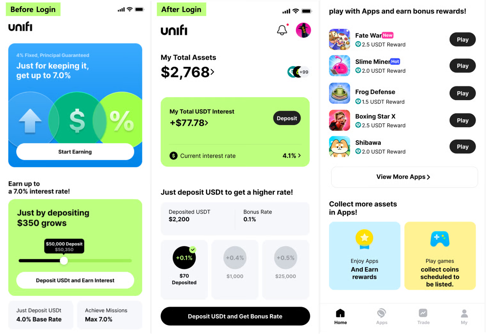

# 유니피

## 홈

이 섹션은 유니피에 USDt를 예치할 때 적용되는 이자율을 소개하며, 사용자가 특정 예치 금액에 대해 얻을 수 있는 이자를 미리 확인할 수 있도록 합니다. 또한, 일정 금액 이상 예치하거나 앱 내에서 결제할 경우 추가 이자율 혜택을 받을 수 있음을 안내합니다. 이 정보는 예금 시뮬레이션 아래에 표시되어, 예금 및 앱 이용과 같은 다양한 행동에 따라 실제로 받을 수 있는 추가 혜택을 확인하도록 합니다. 또한 유니피 홈에 소개된 앱과 보상은 현재 USDt 미션을 진행 중인 것들 중에서 선별됩니다.

<figure><figcaption></figcaption></figure>***

## 앱



이 페이지는 현재 수백만 사용자가 이용 중인 앱을 소개하고, 해당 앱 내 진행 중인 이벤트 및 미션 관련 소식을 알립니다. 최상단 섹션은 유니피 팀과의 협의 후 진행 중인 이벤트나 예정된 TGE(토큰 생성 이벤트) 소식을 공지하는 데 활용될 수 있습니다.

또한 USDt, 카이아(Kaia), NFT 보상이 제공되는 진행 중인 미션을 소개할 수 있습니다. 최대 3개의 미션을 표시할 수 있으며, 노출 우선순위는 보상 지급의 원활성, 미션 난이도, 앱 인기도 등의 요소를 고려한 내부 검토를 통해 결정됩니다.

화면 하단에는 모든 앱이 노출되며, 홍보 대상으로 선정된 앱은 &#x27;편집자 추천&#x27; 섹션에 소개될 수 있습니다. 또한 특정 카테고리, 인기도, 최신 업데이트 기준의 정렬 옵션을 제공하여 사용자가 원하는 앱을 쉽게 찾을 수 있도록 합니다.

<figure><figcaption></figcaption></figure>

 




이 페이지에서는 유니피 팀이 발행한 NFT를 구매하거나 판매할 수 있습니다. 최상단 영역에는 사용자 간 거래(P2P 거래)를 위한 버튼이 제공되며, 하단의 랭킹 영역에는 거래량 기준 순위가 표시됩니다. 순위는 일간, 주간, 월간으로 집계됩니다. 드롭스 영역에는 B2C 판매가 게시됩니다. 앱 팀은 유니피 팀과 협의하여 발행된 NFT를 판매할 수 있습니다. 사용자는 원하는 썸네일을 클릭하여 NFT 정보를 확인하고 구매를 진행할 수 있습니다.

<figure><figcaption></figcaption></figure>


***

## 거래

이 페이지에서는 보유한 토큰을 USDt, KAIA 또는 기타 KAIA 기반 토큰으로 교환할 수 있습니다. 사용자는 앱 플레이를 통해 획득한 토큰을 확인하고, 추가 코인을 획득할 수 있는 앱으로 이동할 수도 있습니다.

또한 화면 상단과 중간 섹션에는 상장 예정이거나 성공적으로 상장된 토큰에 대한 정보를 제공합니다. 이 정보는 사용자 관심을 유도하는 데 활용될 수 있습니다.

<figure><figcaption></figcaption></figure>

***

## 내 자산

이 화면은 사용자가 보유한 자산을 표시합니다. 사용자는 이 화면에서 소유한 KAIA 기반 대체 가능 토큰(FT) 및 대체 불가능 토큰(NFT)을 확인할 수 있으며, USDt 예금으로 발생한 이자와 구매 시점 대비 현재 FT 가치의 변동률(증가 또는 감소)도 확인할 수 있습니다. 또한 사용자는 다른 지갑을 추가하여 해당 지갑 내 보유 자산 상세 정보를 확인할 수 있습니다. 

<figure><figcaption></figcaption></figure>
